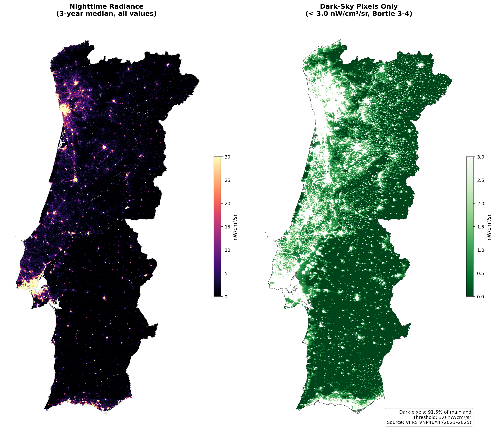
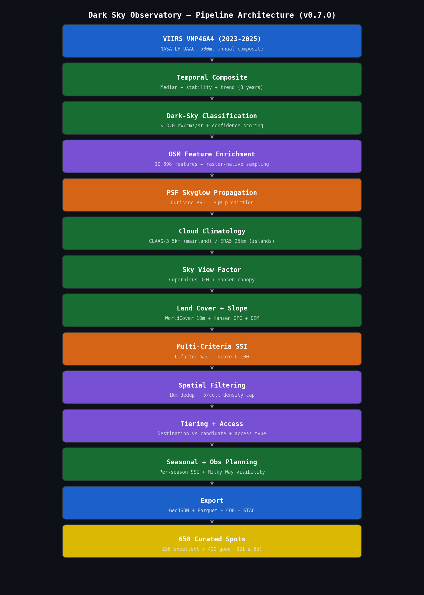
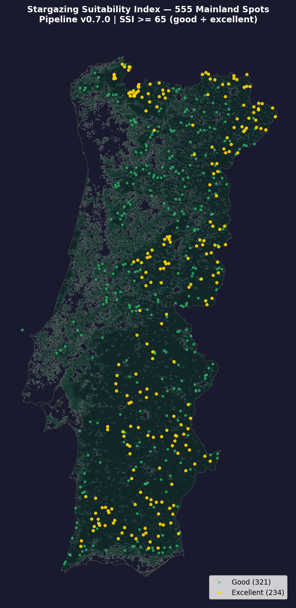

# Dark Sky Observatory

Satellite-derived dark-sky mapping pipeline: ingests VIIRS VNP46A4 nighttime radiance, applies PSF skyglow propagation and multi-criteria scoring, outputs ranked stargazing locations.

[](https://github.com/cygniv404/darksky-observatory/actions/workflows/ci.yml)
[](https://www.python.org/downloads/)
[](https://www.apache.org/licenses/LICENSE-2.0)
[](https://stacspec.org/)

3-year VIIRS median (2023-2025) at 500m resolution, scored by a 6-factor SSI combining PSF-predicted SQM, CLAAS-3/ERA5 cloud climatology, vegetation-aware SVF, land cover, slope, and elevation. Validated against 1,935 ground-truth points (r = 0.937, MAE = 0.286 mag at published sites).



## Quick Start

```bash
git clone https://github.com/cygniv404/darksky-observatory.git
cd darksky-observatory
make install
make test            # 68 tests, no data needed
cp apps/stargazing_spots/.env.example apps/stargazing_spots/.env
# Add EARTHDATA_TOKEN + CDS_API_KEY
make download-data   # ~2GB terrain tiles
make run             # ~36s with local data
```

## Architecture



## Results

| Metric | Value |
|--------|-------|
| Total spots (SSI >= 65) | 658 (555 mainland + 35 Madeira + 68 Azores) |
| SQM range | 20.56 - 22.06 |
| Validation MAE (published SQM) | 0.286 mag (7 sites) |
| Correlation (darkskysites.com) | 0.937 (1,920 points) |
| Expert detection | 100% within 10 km |

Full validation details: [docs/validation_report.md](docs/validation_report.md)




## Project Structure

```
darksky-observatory/
├── apps/stargazing_spots/          # Core EO pipeline (23 modules)
├── notebooks/portugal/             # Analysis notebooks (3)
├── validation/portugal/            # Ground-truth data
├── docs/                           # Methodology, architecture, validation
├── Makefile
└── pyproject.toml                  # uv workspace root
```

## Data Sources

| Dataset | Provider | Resolution |
|---------|----------|-----------|
| Nighttime Lights | NASA LP DAAC (VNP46A4) | 500m annual |
| Cloud Climatology | CM SAF CLAAS-3 / ECMWF ERA5 | 5km / 25km |
| Digital Elevation | Copernicus GLO-30 | 30m |
| Forest Canopy | Hansen GFC | 30m |
| Land Cover | ESA WorldCover | 10m |
| Points of Interest | OpenStreetMap | Vector |

## Methodology

PSF skyglow model (Garstang 1986, Duriscoe 2018 softening) predicts clear-sky SQM via FFT convolution over 200km radius. Cloud fraction from CLAAS-3 satellite observations (mainland) or ERA5 reanalysis (islands) restricted to astronomical darkness. SVF computed from DEM + Hansen canopy. Weighted linear combination produces a 0-100 SSI per spot.

Full methodology: [docs/methodology.md](docs/methodology.md)

## Limitations

- PSF model carries +/-0.5 mag systematic uncertainty vs full radiative transfer. Rankings are reliable; absolute SQM values are optimistic.
- 3-year radiance variability is indicative, not a statistically significant trend (Kyba et al. 2017: need 5+ years).
- Calibration fitted for Portuguese atmospheric conditions. Other regions require re-fitting.
- Cloud data at 5-25km cannot resolve valley fog or sub-km microclimates.

## License

Apache 2.0
